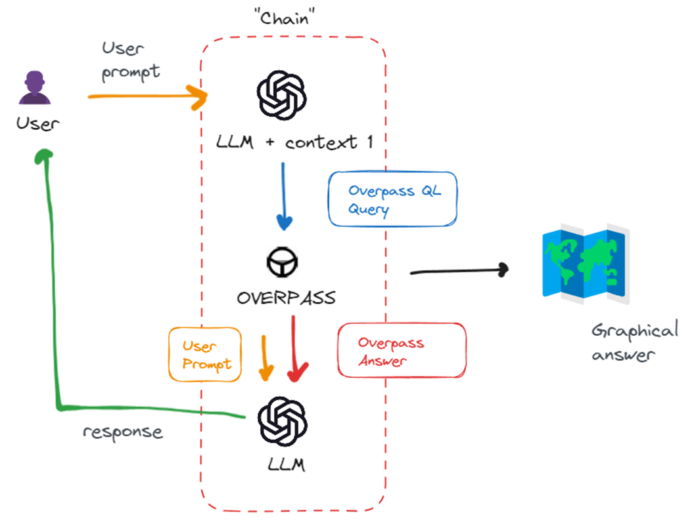
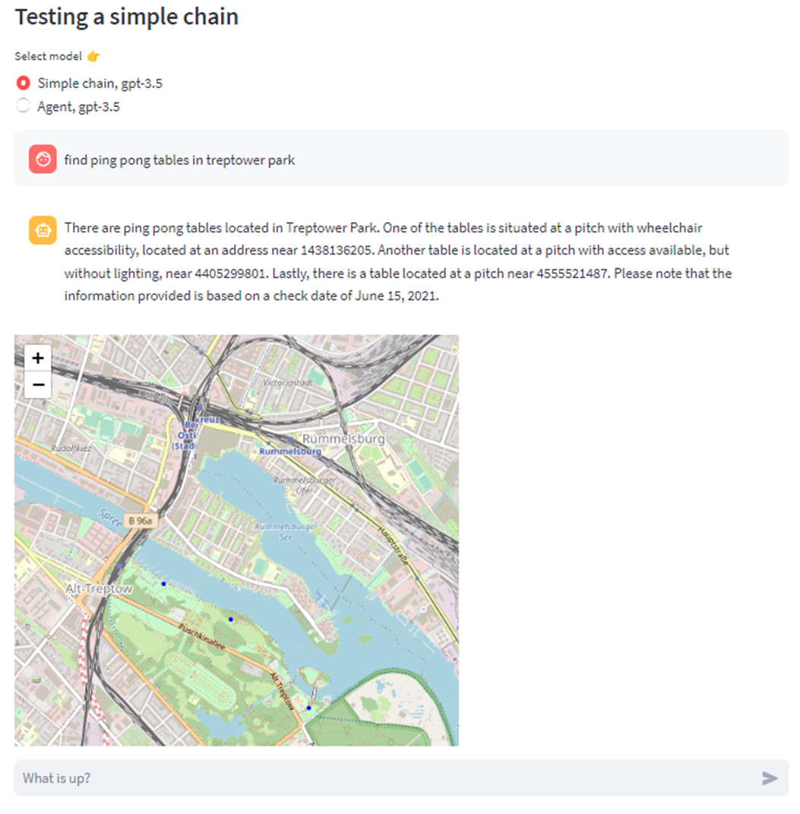

# NaturalMaps
A Portfolio project by Pasquale Zito, Adam Hughes and Justin Zarb as part of Data Science Retreat.

NaturalMaps is an attempt to explore maps with natural language, such as “Find all the quietest coffee shops in Berlin that open before 8 AM and are in close proximity to a library.” At the moment, this is readily accessible open data, but going beyond simple queries requires expert know-how. We are exploring ways to make this information and analysis more accessible to the user.

## Objectives
- Use natural language processing to make map queries more accessible to non-specialists.
- Overlay other datasets such as air pollution, noise, shade, etc. to benefit individuals as well as planners.

## Approaches
Both of the approaches discussed below use GPT-3.5-turbo.

### Function Calls using a plan-and-execute style agent
The architecture of the main bot used for demo day.
The agent is aware of certain functions it is able to call. Using system prompts, the first response is a list of steps needed to answer the user's question using the available functions. The LLM is then given some iterations to run functions (eg. api calls to Overpass Turbo) and produce a final answer using the results. 

### Langchain
Currently implemented in the langchain branch, this is the more promising architecture moving forward. Also includes an implementation of a plan-and-execute agent (inspiration for the above)

